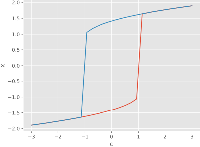

---
hide:
  - toc
  - navigation
---

# __Dynamical Simulation Collaboration__
### Building open-source tools for modeling, simulation, and analysis across mathematics, physics, chemistry, and biology.

---
<div class="grid cards" markdown>

- { align=left , width="500" } 
```py
import numpy as np
from poincare import *

class BiasedDouble(System):
    x: Variable = initial(default=-2)
    v: Derivative = x.derive(initial=0)
    c: Parameter = assign(default=1)

    eq = v.derive() << -v - x**3 + 2 * x + c

sim_2 = Simulator(BiasedDouble)
steady = SteadyState(t_end=1000)
uad = steady.sweep_up_and_down(sim_2, variable=BiasedDouble.c, 
                               values=np.linspace(-3, 3, 30))

uad.sel(direction="up")["x"].plot()
uad.sel(direction="down")["x"].plot()
```
</div>
<div style="text-align:center;"> <i><a href="https://en.wikipedia.org/wiki/Bistability">Bistability</a> plot for the biased double well implemented in Poincare. </i></div>
---
## Libraries
<div class="grid cards" markdown>

- :simple-spring_creators: __Poincare__

    ---

    General dynamical system simulation in python. [Learn more](poincare.md).
    
- :material-test-tube: __SimBio__

    ---

    Simulation of chemical reaction networks in python. [Learn more](simbio.md).

-  :octicons-move-to-top-24: __Jablonski__

    ---

    Simulation of photochemical systems in python. [Learn more](jablonski.md).

</div>


---
## About

Dyscolab is an organization dedicated to the creation of open source tools for  modeling, simulation, and analysis of dynamical systems. It maintains 3 main python libraries, as well as a number of other utilities: 

- [Poincare](poincare.md): general dynamical systems simulation. It's the basis on which the others are built.
- [SimBio](simbio.md): chemical reaction networks simulation. Built on Poincare, it adds a number of bindings specific to chemical reactions, such as `Species`, `MassAction` or `Synthesis`.
- [Jablonski](jablonski.md): photochemical systems simulation. Similarly to SimBio, it builds on Poincare by adding specific bindings such as `SingletState`, `Absortion` or `Fluoresence`. It is still in development.
- [Other libraries](other.md): Dyscolab also maintains other libraries which are auxiliary or related to the main user facing ones. 

--- 
## Contact
The dyscolab [discussion forums](https://github.com/orgs/dyscolab/discussions) on github are the main form of communication for dyscolab related topics. 

Dyscolab projects are maintained by:

- Tomás Di Napoli: tomas.dina98@gmail.com
- Hernán E. Greco:
- Mauro Silberberg: maurosilber@gmail.com.
- Oliverio Starosta: oliveriostarosta@gmail.com. 


