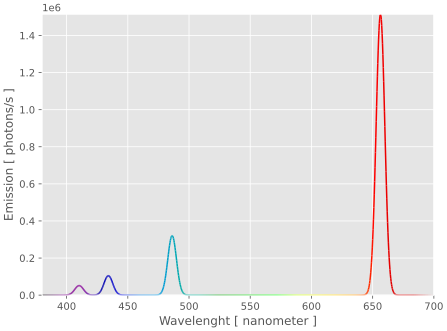

---
hide:
  - navigation
---
# Jablonski
<div class="grid cards" markdown>

- { align=left , width="375" } 
```py
from jablonski.plots import graph_spectra

fig, ax = graph_spectra(
    Hydrogen,
    [
        Hydrogen.absorption_1,
        Hydrogen.absorption_2,
        Hydrogen.absorption_3,
        Hydrogen.absorption_4,
    ],
    height=1e8/(u.cm**2 *u.s),
)
```
</div>
<div style="text-align:center;">  Spectra from simplified hydrogen model in Jablonski. Widths are arbitrary. </i></div>
Jablonski is a Python-based package for simulation of photochemical systems. It extends [poincare](https://github.com/dyscolab/poincare), a package for modelling dynamical systems. It's designed around:

- __Modularity__: Jablonski is intended to create a layer to separate the actual declaration and simulation of models, allowing to easily switch between methods and compile to different backends (including [NumPy](https://numpy.org/) [Numba](https://numba.pydata.org/) and [JAX](https://docs.jax.dev/en/latest/)). 

- __Composability__: models are composable, allowing for the combination of smaller systems to create larger ones; complex models can be broken up into more manageable parts.

- __Reproducibility__: it intends to be a centralized place for all information concerning models, making it easy to extract data about information and parameters and encouraging consistency between analytical formulations and numerical implementations.

- __Utility__: jablonski contains a number of simulation and analysis tools, such as piecewise simulation for pulse excitations and getting a system's time resolved and steady state emission spectra.

---
## Installation


It can be installed from PyPI:

```sh
pip install -U jablonski
```

or conda-forge:

```sh
conda install -c conda-forge jablonski
```

---
## Documentation
Documentation is structured as a series of interactive [marimo](https://marimo.io/) notebooks which cover basic and advanced topics. They can be ran by following the links in the highlighted titles to open them in the browser or by cloning the [dyscolab-tutorials](https://github.com/dyscolab/dyscolab-tutorials) repository to open them locally. For more information, see [Pioncare's documentation](poincare.md#documentation).
### Basics
- [Getting started with Jablonski](https://marimo.app/https://github.com/dyscolab/dyscolab-tutorials/blob/main/jablonski/getting_started_with_jablonski.py): the essentials necessary to use jablonski.