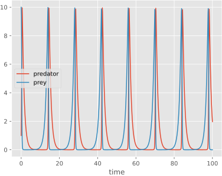

---
hide:
  - navigation
---
# Poincare


<div class="grid cards" markdown>

- { align=left , width="375" } 
```py
import numpy as np
from poincare imprt *

class LotkaVolterra(System):
    prey: Variable = initial(default=10)
    predator: Variable = initial(default=1)

    prey_eq = prey.derive() << prey * (1 - predator)
    predator_eq = predator.derive() << predator * (prey - 1)

sim = Simulator(LotkaVolterra)
sim.solve(save_at=np.linspace(0, 100, 1000)).plot()
```
</div>
<div style="text-align:center;"> <i><a href="https://en.wikipedia.org/wiki/Lotka%E2%80%93Volterra_equations">Lokta-Volterra</a> predator-prey model implemeneted in poincare. </i></div>

Poincare is a python library for declaring and simulating dynamical systems. It's designed around:

- __Modularity__: poincare creates a layer to separate the actual declaration and simulation of models, allowing to easily switch between methods and compile to different backends (including [NumPy](https://numpy.org/), [Numba](https://numba.pydata.org/) and [JAX](https://docs.jax.dev/en/latest/)).
- __Composability__: models are composable, allowing for the combination of smaller systems to create larger ones; complex models can be broken up into more manageable parts.
- __Reproducibility__: it intends to be a centralized place for all information concerning models, making it easy to extract data (equations, parameters, etc...) and encouraging consistency between analytical formulations and numerical implementations.
- __Utility__: poincare includes a number of utilities to make model analysis more convenient, including searching for steady states, bistability or limit cycles across a range of parameter values.

---
## Installation 

It can be installed from PyPI:

```sh
pip install -U poincare
```

or conda-forge:

```sh
conda install -c conda-forge poincare
```

---
## Documentation
Documentation is structured as a series of interactive notebooks which cover basic and advanced topics.
### Basics
- [Getting started with Poincare](https://colab.research.google.com/github/dyscolab/poincare/blob/main/docs/Getting_started_with_poincare.ipynb): the essentials necessary to simulate models.
- [Composition](https://colab.research.google.com/github/dyscolab/poincare/blob/main/docs/Composing.ipynb): how to combine smaller models to create more complex ones, one of Poincare's key features.
- [Simulators](https://colab.research.google.com/github/dyscolab/poincare/blob/main/docs/Simulation.ipynb): more on how configure the simulation, including switching methods and backends.
### Topic guides
- [Asymptotic behaviour and parameter sweeps](https://colab.research.google.com/github/dyscolab/poincare/blob/main/docs/Asymptotic_behaviour.ipynb): characterize the asymptotic behaviour of the system, including the search for steady states, bistability and limit cycles, across a range of parameter values.
