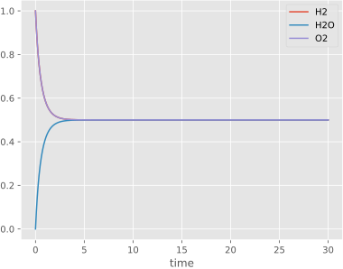

---
hide:
  - navigation
---
# SimBio
<div class="grid cards" markdown>

- { align=left , width="400" } 
```py
from simbio import *
from simbio.reactions import *
import numpy as np

class Water(System):
    H2: Variable = initial(default=1)
    O2: Variable = initial(default=1)
    H2O: Variable = initial(default=0)

    creation = Synthesis(A=2 * H2, B=O2, AB=2 * H2O, rate=1)
    electrolysis = Dissociation(AB=2 * H2O, A=2 * H2, B=O2, rate=0.5)

sim = Simulator(Water)
sim.solve(save_at=np.linspace(0, 30, 1000)).to_dataframe().plot()
```
</div>
<div style="text-align:center;"><i>Water synthesis and <a href="https://en.wikipedia.org/wiki/Electrolysis">electrolysis</a> implemeneted in SimBio. </i></div>
SimBio is a Python-based package for simulation of Chemical Reaction Networks (CRNs). It extends [poincare](https://github.com/dyscolab/poincare), a package for modelling dynamical systems, to add functionality for CRNs. It's designed around:

- __Modularity__: SimBio is intended to create a layer to separate the actual declaration and simulation of models, allowing to easily switch between methods and compile to different backends (including [NumPy](https://numpy.org/) [Numba](https://numba.pydata.org/) and [JAX](https://docs.jax.dev/en/latest/)). The same model can be compiled for either ODE or stochastic simulation by changing a single line of code (upcoming).
- __Composability__: models are composable, allowing for the combination of smaller systems to create larger ones; complex models can be broken up into more manageable parts.
- __Reproducibility__: it intends to be a centralized place for all information concerning models, making it easy to extract data about information and parameters and encouraging consistency between analytical formulations and numerical implementations. Models can also be imported directly from the [SMBL](https://sbml.org/) format (upcoming).

---
## Installation

Using [pixi](https://pixi.sh/latest/),
install from PyPI with:

```sh
pixi add --pypi simbio
```

or install the latest development version from GitHub with:

```sh
pixi add --pypi simbio@https://github.com/dyscolab/simbio.git
```

Otherwise,
use `pip` or your `pip`-compatible package manager:

```sh
pip install simbio  # from PyPI
pip install git+https://github.com/dyscolab/simbio.git  # from GitHub
```

---
## Documentation
Documentation is structured as a series of interactive [marimo](https://marimo.io/) notebooks which cover basic and advanced topics. They can be ran by following the links in the highlighted titles to open them in the browser or by cloning the [dyscolab-tutorials](https://github.com/dyscolab/dyscolab-tutorials) repository to open them locally. For more information, see [Pioncare's documentation](poincare.md#documentation).
### Basics
- [Getting started with SimBio](https://marimo.app/github.com/dyscolab/dyscolab-tutorials/blob/main/simbio/getting_started_with_simbio.py): the essentials necessary to simulate CNRs.
- [Implementing the repressilator in SimBio](https://marimo.app/https://github.com/dyscolab/dyscolab-tutorials/blob/main/simbio/repressilator.py): an example showing an implementation of the [repressilator](https://en.wikipedia.org/wiki/Repressilator) model in SimBio, including model definition by composition of smaller parts, simulation and parameter sweeps looking at how the period changes.
<!-- ### Topic guides
- [Importing systems from SBML and BioModels](https://colab.research.google.com/github/dyscolab/simbio/blob/master/docs/notebooks/import_sbml.ipynb): how to import models from the [BioModels](https://www.ebi.ac.uk/biomodels/) platform or locally hosted [SBML](https://sbml.org/) (Systems Biology Markup Language) files. 
- [Stochastic simulations](https://colab.research.google.com/github/dyscolab/simbio/blob/master/docs/notebooks/Stochastic.ipynb): simulate models stochastically using [Gillespie's algorithm](https://en.wikipedia.org/wiki/Gillespie_algorithm). -->

## GitHub
SimBio is developed in it's [github repo](https://github.com/dyscolab/simbio).
