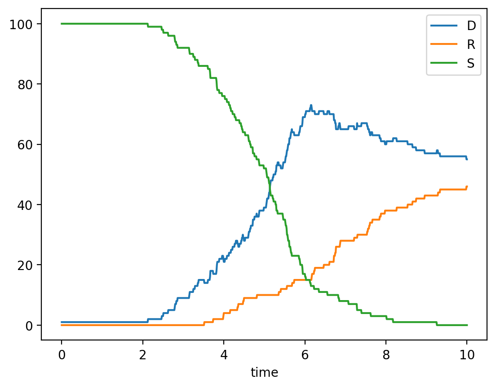
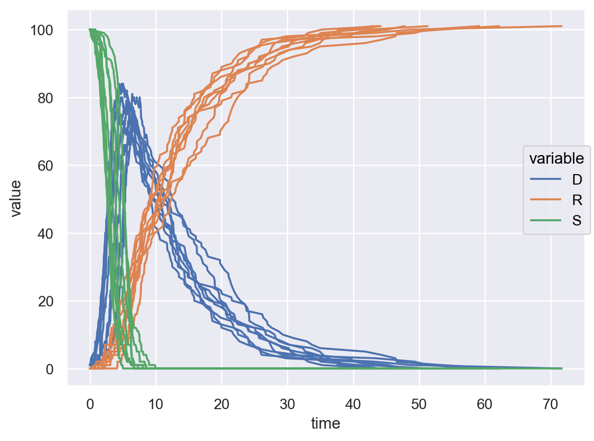
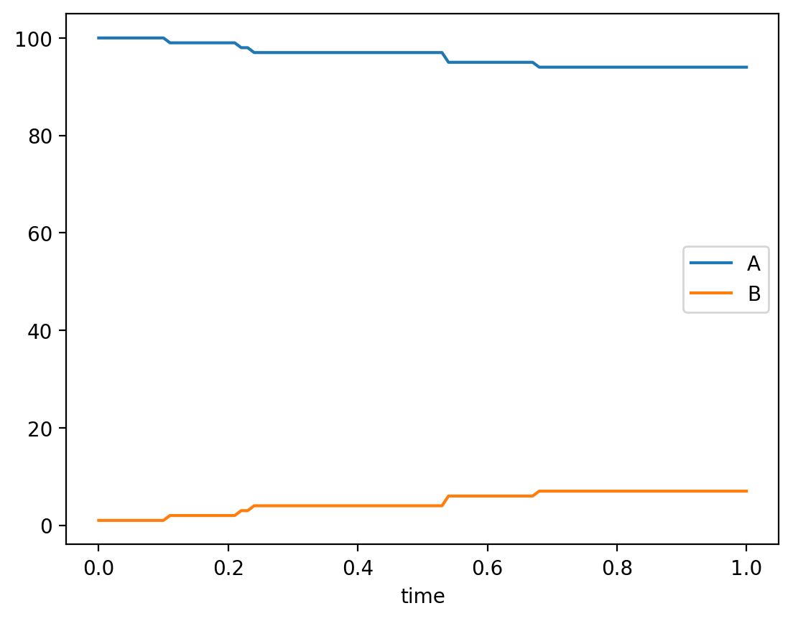

# Stochastic simulations in SimBio
_Note: this tutorial is present as a page instead of an interactive notebook because stochastic simulation uses the rebop package that cannot run on pyodide since it is written in rust. The interactive version can be found in the [dyscolab-tutorials repo](https://github.com/dyscolab/dyscolab-tutorials)._

Simbio contains the capability to stochastically simulate systems using the [Gillespie algorithm](http://en.wikipedia.org/wiki/Gillespie_algorithm); this is preferable over ODE based simulations for reactions where small amounts of reactantas are present. Simbio uses the [rebop](https://rebop.readthedocs.io/en/latest/) library for this, which must be installed separately:
```bash
pip install rebop
```
To stochastically simulate a `System`, which we can define noramlly:

```python {.marimo}
import xarray as xr
from simbio.rebop import RebopSimulator
from simbio import System, Variable, initial, MassAction, RateLaw

class Infection(System):
    S: Variable = initial(default=100)
    D: Variable = initial(default=1)
    R: Variable = initial(default=0)

    r_infect = MassAction(reactants=[S, D], products=[2 * D], rate=0.015)
    r_cure = MassAction(reactants=[D], products=[R], rate=0.1)
```

We can create a `RebopSimulator` for it:

```python {.marimo}
rebsim = RebopSimulator(Infection)
result = rebsim.solve(n_points=1000, upto_t=10)
result.to_dataframe().plot()
```
{ width="500"}

Unlike the regular `Simulator.solve()` which takes an iterable of times to `save_at`, `RebopSimulator.solve()` takes arguments `upto_t` to control simulation end time and `n_points` which decides how many equally spaced times are sampled. Since it doesn't count 0, `n_points` = N will a `Dataset` with a N + 1 size time coordinate:

```python {.marimo}
len(result.coords["time"])
>>> 1001
```

To manually set a seed, we must pass it to the `rng` argument:

```python {.marimo}
_result = rebsim.solve(n_points=1000, upto_t=10, rng=23534256).to_dataframe().plot()
```

Of course, since the simulation is stochastic the result will be different every time its run. We can run it many times to get a better idea of the system's behaviour:

```python {.marimo}
import seaborn.objects as so

df_100 = (
    xr.concat(
        [rebsim.solve(n_points=0, upto_t=100) for _ in range(10)],
        dim="seed",
        join="outer",
    )
    .to_dataframe()
    .melt(ignore_index=False)
    .reset_index()
)
df_100
so.Plot(df_100, x="time", y="value", color="variable", group="seed").add(so.Lines()).show()
```
{ width="500"}

## RateLaws and arbitrary rates
Stochastic simulation support a reduced subset of `symbolite` functions and operators for rates both in RateLaws and MassActions.

```python {.marimo}
from symbolite import real
class Model(System):
    A: Variable = initial(default = 100)
    B: Variable = initial(default = 1)

    r = RateLaw(reactants = [A], products = [B], rate_law = real.sqrt(A)+1)
rebsim_2 = RebopSimulator(Model)
rebsim_2.solve(n_points=10, upto_t=1)
```
{ width="500"}

Rates and rate_laws can include:

- Basic operations: +, -, *, / and \*\*.
- Functions that can be converted to powers: `real.exp`, `real.sqrt` and `real.hypot`.
- Functions that can be converted to multiplication: `real.degrees` and `real.radians`
- Mathematical constants: `real.e`, `real.pi` and `real.tau`.